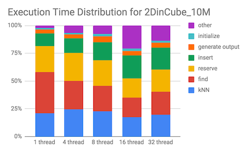
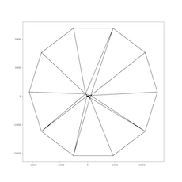
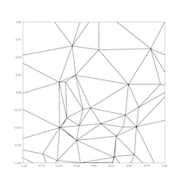

# Checkpoint

## Summary of Work Completed

During the past weeks, our team has been focused on three main tasks: 1) learning the details of Randomized Incremental Delaunay Triangulation algorithm, 2) familiarizing with and profiling the existing baseline sequential and parallel implementations provided in the PBBS package, and 3) exploring GPU implementation of the baseline triangulation algorithm. 

We first conducted a literature review to learn about the details of Boissonnat and Teillaud’s Incremental Delaunay Triangulation algorithm, which is the particular approach implemented in the PBBS package. We then reviewed both the sequential and parallel implementation provided in PBBS. Since the code base in PBBS is quite large with many components, this task took a significant amount of time. We then profiled the OpenMP implementation of the algorithm provided in the PBBS code base to identify the performance bottlenecks that can be potentially optimized in a GPU implementation. We have found that the OpenMP and Clik implementations in PBBS are highly optimized. Currently, we are working on a GPU implementation to optimize the computation-heavy components of the algorithm. However, we believe that the current implementation of Delaunay Triangulation does not lend itself well to a GPU implementation and will therefore adjust our project schedule by one week to give us more time to explore GPU implementations.

##  Summary of Current Profiling Findings

We summarize some observations of the baseline Delaunay Triangulation code provided in PBBS.

### Cache Miss Behavior

Using perf, we observe that the implementation has poor spatial and temporal locality because of the near-random access of vertex data. The random access behavior is caused by the random permutation of the vertices at the beginning of the algorithm.

### Varying number of processors

We profiled the execution time of the OpenMP implementation with the same workload (10 million points uniformly distributed in a square) under varying number of threads. The total execution times and the breakdown of the execution time on each component are plotted below:

  <!-- .element style="width: 500px" -->

We observe that the majority of time spent is spent on `find` and `reserveForInsert` (*reserve* as shown in the plot). As number of threads increase, time spent on `find` decreases, and time spent on `reserveForInsert` increases. This is expected since the work required to find the triangle containing the vertex decreases per thread as the number of threads increases. In `reserveForInsert`, each thread attempts to lock potentially overlapping sets of vertices using compare-and-swap, which leads to increased contention as the number of threads increases.

### Test Inputs

We test the triangulation on 2D points generated from three distributions: uniform distribution in a square, uniform distribution in a circle, and Kuzmin distribution in a circle. The visualization of the triangulation for each distribution is provided below:

|        | Square, uniform           | Circle, uniform  | Circle, Kuzmin  |
| :-------------: |:-------------:| -----| -----|
| Full view   |  |  | |
| Zoomed to 2x2 square centered about the origin  |   |  | |

## Challenges and Concerns

### The Use of K-Nearest Neighbors (KNN)
The implementation uses KNN to speed up the search for the triangle containing a given vertex. Beginning the search at the nearest neighbor triangle of the vertex speeds up the search process significantly (an estimated 50x speedup) compared to beginning the search at a random triangle. However, the KNN implementation is done using an oct-tree and parallelizing the oct-tree is very similar to parallelizing of Barnes-Hut simulation, which is a difficult problem in itself and may be out of the scope of this project due to limited time. 

### Retry Rate and Contention
The OpenMP implementation implements a scheme of locking each vertices using compare-and-exchange. Threads that fail to acquire the lock to any of the vertices that it needs for insertion will have to perform “retry” and recompute its set of vertices. We observe that the number of retry increases as the iteration number increases. We believe reducing the number of retries reduces lock contentions should be a focus and a key in optimizing the algorithm. However, we also recognize that reducing contention may require fundamental changes in the parallel algorithm.

### Limitations of Boissonnat and Teillaud’s Approach
As mentioned above, Boissonnat and Teillaud’s triangulation approach tend to not be the preferred implementation for GPU implementations due to its inherent algorithmic limitations. In particular, the arithmetic intensity of this approach is low and there is not enough parallel work to fill a GPU. The steps of the algorithm are dependent on each other, and requires synchronization of results from calculations. Finally, this approach requires large global data structures: the KNN and the queue.

## Goals and Deliverable Update

In general, we believe that the project is currently on-schedule. We have thoroughly understood both the Delaunay Triangulation algorithm as well as its associated implementations. Furthermore, we have began exploring GPU optimizations of the algorithm. However, because of the complexity of the algorithm and baseline code, we expect that we will spend another half week to one week in order to complete a GPU implementation. From literature surveys its seems that Boissonnat and Teillaud’s particular approach to Delaunay Triangulation may not lend itself well with a GPU implementation. Instead, approaches based on Voronoi Diagram constructions seem to be more commonly implemented in GPU. Therefore, we currently do not expect our GPU implementation to yield significant speedup. 

An interesting approach to scaling Delaunay Triangulation would be to explore a distributed computations based on message passing. Since Delaunay Triangulation is often used in finite element models of billions of points, an approach that first partitions the points then generates local triangulations before combining these local triangulations into a final global triangulation would allow the algorithm to scale to a large number of points. Therefore, much of the remaining time of the project will be spent on exploring distributed Delaunay Triangulation using message passing with MPI.

**Plan:**
We will no longer apply the parallelized algorithm to 3D triangulations due to limited time. Otherwise, the goals for this project remain largely unchanged:

Implement a joint CPU-GPU approach utilizing both CUDA and OpenMP
Implement a distributed Delaunay Triangulation supporting large point counts using MPI

**Nice to Have:**
We expect the performance of our GPU implementation of Boissonnat and Teillaud’s approach to be not as good as the baseline OpenMP approach. If time permits, we would like to explore other GPU approaches for better speedup.

**Poster Session:**
We will rely on speedup graphs and plots of triangulation outputs to present our results during the poster session.

## Adjusted project scope and schedule

We will spend an extra week exploring GPU implementations, so in the final week, we will no longer explore higher dimensional points because of time constraints. An updated project schedule is presented below:

| Week        | Dates           | Tasks  | Assignee |
| :-------------: |:-------------:| -----| -----|
| 3 | 11/18 - 11/24     |   Complete GPU implementation without KNN  Implement GPU Memory Optimizations | Harvey  Connie |
| 4 | 11/25 - 12/1     |  Debug GPU implementation and profile  Research distributed partition schemes  Implement work partitioning scheme | Harvey  Both  Connie |
| 5 | 12/2 - 12/8    |   Implement efficient merging of local triangulations  Research/Brainstorm approaches to reducing thread contention and communication  Explore optimizing KNN implementation and memory optimizations | Harvey  Both  Connie |
| 6 | 12/9 - 12/15     |  Profile Communication and Cache Behavior of MPI implementation  Profile Execution Time and Run Time Distribution  Complete Presentation Poster | Harvey  Connie  Both |

